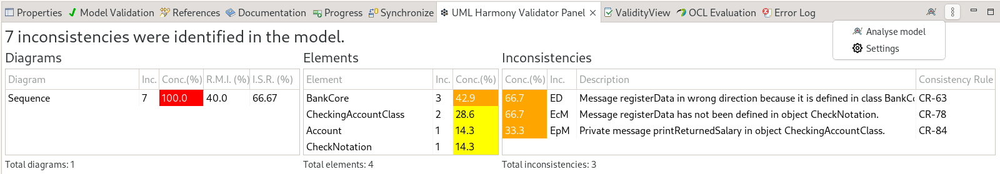
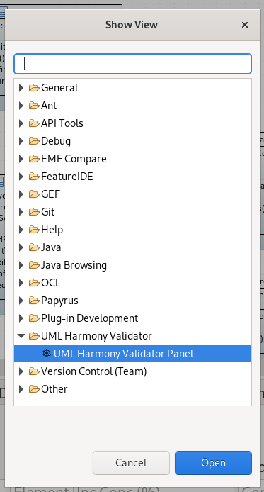
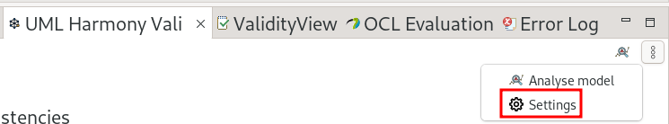
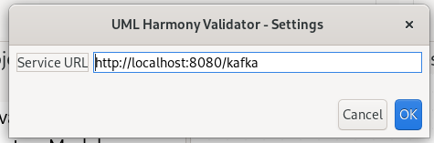
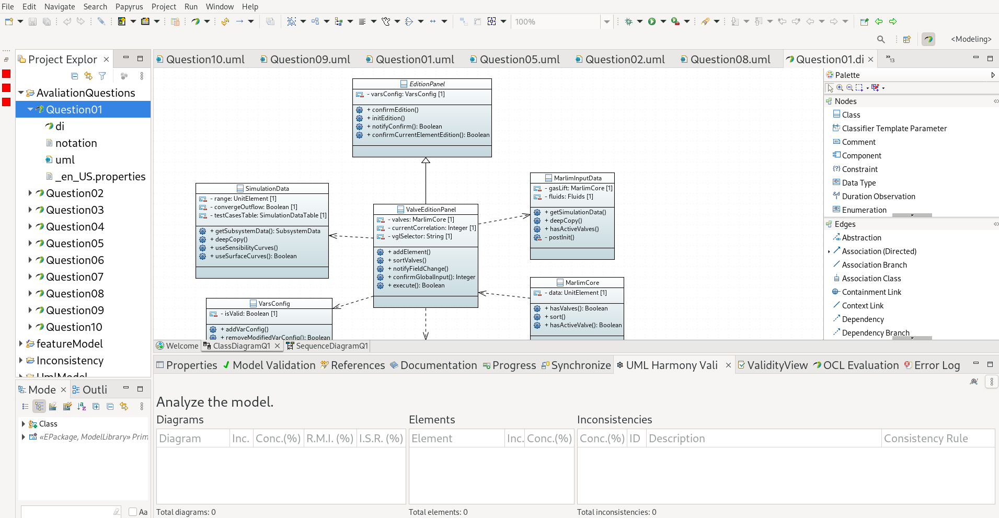
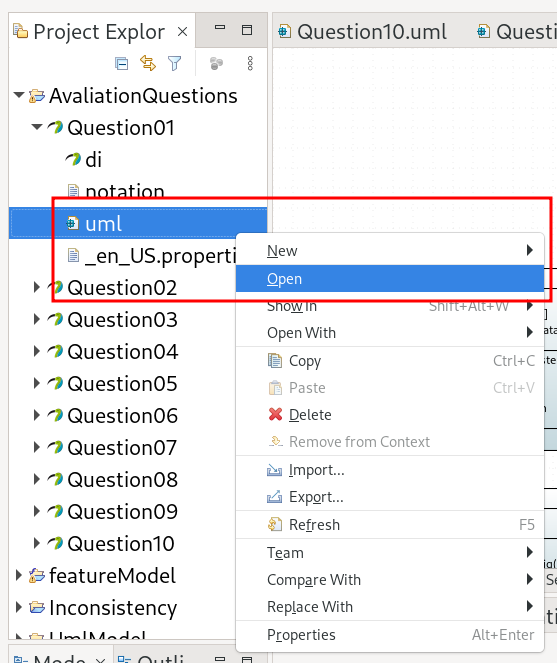
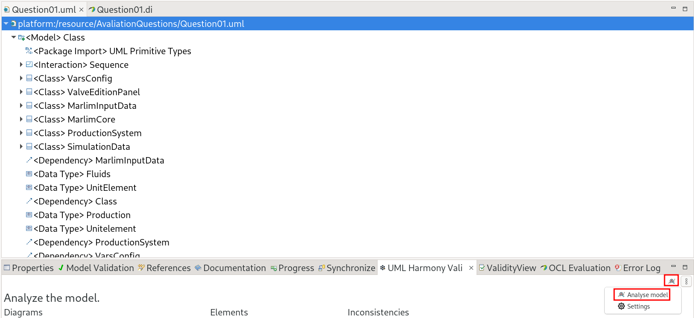
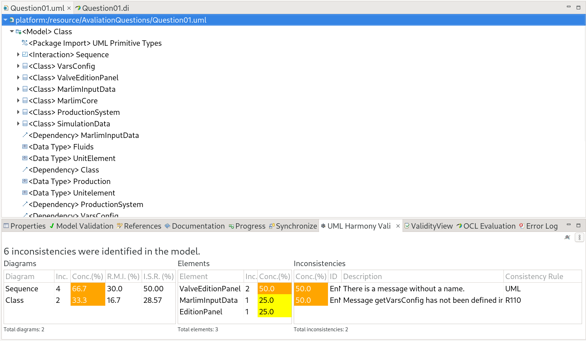
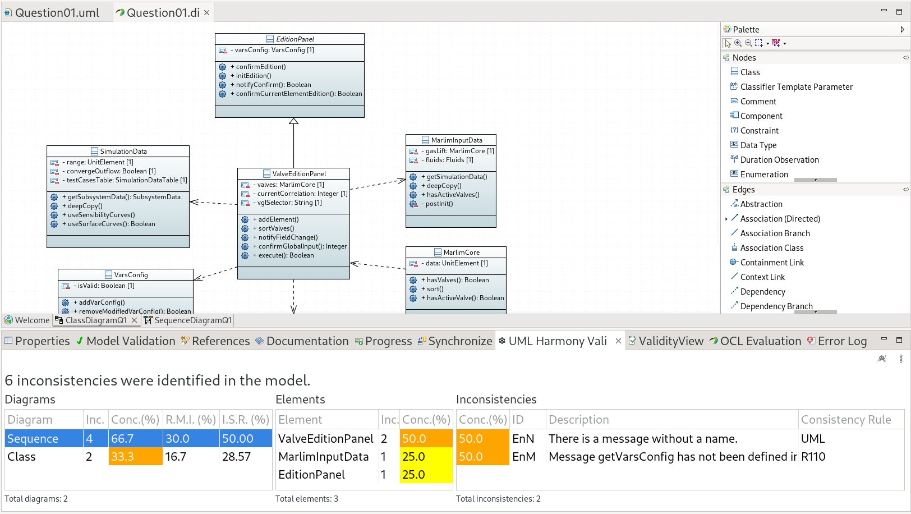
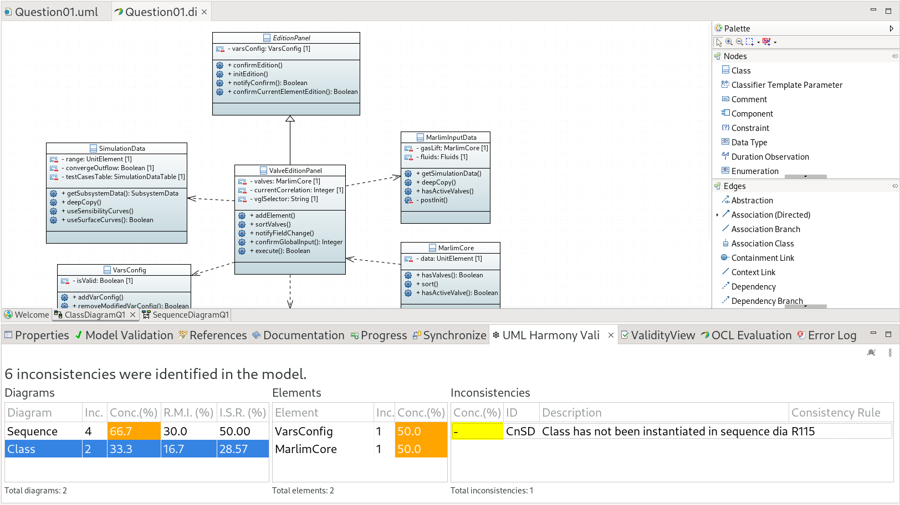

# UML Harmony Validator – Eclipse Plug-in

The **UML Harmony Validator Plug-in** extends the **Eclipse Modeling Framework (EMF)**, allowing users to **analyze UML models** directly from the Eclipse IDE.
It connects to a remote validation [service](https://github.com/luanlazz/uml-harmony-validator-service?tab=readme-ov-file#uml-harmony-validator-server---detection-of-inconsistencies) to detect **inconsistencies** in UML Class and Sequence Diagrams.

- [UML Harmony Validator – Eclipse Plug-in](#uml-harmony-validator--eclipse-plug-in)
  - [🧭 Overview](#-overview)
  - [🏗️ Features](#️-features)
  - [⚙️ Architecture](#️-architecture)
  - [🚀 Installation](#-installation)
    - [Option 1 – Download Prebuilt JAR (recommended)](#option-1--download-prebuilt-jar-recommended)
    - [Option 2 – Build from Source (manual)](#option-2--build-from-source-manual)
  - [🧩 Configuration](#-configuration)
  - [🔎 Usage](#-usage)
  - [📄 License](#-license)
  - [🤝 Related Projects](#-related-projects)
  - [Supported Inconsistency Types](#supported-inconsistency-types)

## 🧭 Overview

This plug-in provides an integrated workflow for model validation within Eclipse:



* **Analyze Model**: Sends the current UML model to the validation service for analysis.
* **Settings**: Allows configuration of the service URL.

> The plug-in communicates with the [UML Harmony Validator Service](https://github.com/luanlazz/uml-harmony-validator-service?tab=readme-ov-file#uml-harmony-validator-server---detection-of-inconsistencies) to perform the actual analysis.

## 🏗️ Features

* Validate UML models (Class and Sequence Diagrams) directly within Eclipse.
* Detect multiple types of inconsistencies (e.g., class duplication, abstract instantiation, missing methods).
* Configure service endpoint through the settings dialog.
* Lightweight integration with existing EMF-based projects.

## ⚙️ Architecture

* **Platform:** Eclipse (EMF-based plug-in)
* **Backend Communication:** REST API
* **Core Technologies:**
  * Eclipse Plug-in Development Environment (PDE)
  * EMF (Eclipse Modeling Framework)
  * Java 17+
* **External Dependency:** UML Harmony Validator Service (backend analyzer)

## 🚀 Installation

### Option 1 – Download Prebuilt JAR (recommended)

1. Go to the [Releases](../../releases) page of this repository.
2. Download the latest `uml-harmony-validator-plugin-<version>.jar` file.
3. Copy the downloaded `.jar` into your Eclipse **`dropins/`** folder.

   > 💡 If the `dropins/` folder does not exist, create it yourself in the Eclipse root directory.
4. Restart Eclipse. The plug-in should load automatically.

### Option 2 – Build from Source (manual)

1. Clone this repository:

   ```bash
   gh repo clone luanlazz/uml-harmony-validator-plugin
   cd uml-harmony-validator-plugin
   ```
2. Open **Eclipse IDE for RCP and RAP Developers**.
3. Go to **File ▸ Import ▸ Existing Projects into Workspace**, and select the cloned folder.
4. Once imported, open the **plugin.xml** file to verify that dependencies are resolved.
5. Export the plug-in:

   * Go to **File ▸ Export ▸ Plug-in Development ▸ Deployable plug-ins and fragments**.
   * Select the **UML Harmony Validator** project.
   * Choose a **destination directory** (e.g., `export/` folder).
   * Finish the export to generate the `.jar` file.
6. Copy the exported `.jar` into your Eclipse **`dropins/`** directory.

   > 💡 If the `dropins/` folder does not exist, create it yourself in the Eclipse root directory.
7. Restart Eclipse to activate the plug-in.

> [!TIP]
> You can confirm the installation by opening Eclipse and checking if the **UML Harmony Validator Panel** is available:  
> Go to **Window ▸ Show View ▸ Other...**, then search for **UML Harmony Validator Panel** in the pop-up dialog.

## 🧩 Configuration

1. In Eclipse, open it by navigating to **Window ▸ Show View ▸ Other...**, then searching for **UML Harmony Validator Panel** in the pop-up dialog, double click to add to your workspace.
   
   

2. Open the **UML Harmony Validator ▸ Plug-in Settings** menu.
   

   

4. Set the **Service URL** to point to the backend validator service, for example:
   ```
   http://localhost:8080/kafka
   ```
5. Click **Ok**.

> [!TIP]
> The plug-in stores these settings in Eclipse preferences for persistent use between sessions.

## 🔎 Usage

1. Open any UML project file within your Eclipse workspace.
   
   

2. Open any UML model (`.uml`).
   
   

3. On Plug-in view click on short-cut icon or navigate to:
  **Menu ▸ Analyze Model**
   
   

4. The plug-in will:
   * Send the model to the configured backend service.
   * Retrieve and display inconsistency results in the **Plug-in View**.
   
   

5. Navigate between inconsistency results:
   - Diagram and element boxes are interactive.
   - Click a **diagram** to display its **elements**, then click an **element** to view its corresponding **inconsistencies**.
   
   
   
   

> [!NOTE]
> Internet or local network access is required to reach the configured service URL.

## Supported Inconsistency Types
 
| Code | Name / Description | Formal Definition | CR | Diagrams |
| ---- | ------------------ | ----------------- | -- | -------- |
| **Cm** | **Class Multiplicity**<br>Multiple definitions of classes with the same name. | `IF not classUniqueName THEN Cm inconsistency` | UML | CD |
| **Om** | **Object Multiplicity**<br>Multiple definitions of objects with the same name. | `IF not lifelineUniqueName THEN Om inconsistency` | UML | SD |
| **CnSD** | **Class not in Sequence Diagram**<br>Class not instantiated in the Sequence Diagram. | `IF not R115 THEN CnSD inconsistency` | R115 | CD, SD |
| **CnCD** | **Class not in Class Diagram**<br>Object without an associated class in the Class Diagram. | `IF not classExists THEN CnCD inconsistency` | UML | SD, CD |
| **ED** | **Erroneous Direction**<br>Message sent in the wrong direction. | `IF not R110 and messageBelongSender THEN ED inconsistency` | R110 | SD, CD |
| **EnM** | **Element without Method**<br>Message without a corresponding method. | `IF not R110 THEN EnM inconsistency` | R110 | SD, CD |
| **EnN** | **Element without Name**<br>Message without a name. | `IF not messageName THEN EnN inconsistency` | UML | SD |
| **MnSD** | **Method not in Sequence Diagram**<br>Method defined in the Class Diagram but not called in the Sequence Diagram. | `IF not R114 THEN MnSD inconsistency` | R114 | CD, SD |
| **ACSD** | **Abstract Class in Sequence Diagram**<br>Abstract class instantiated in the Sequence Diagram. | `IF not R108 THEN ACSD inconsistency` | R108 | CD, SD |
| **CnoM** | **Class without Methods**<br>Class without any defined methods. | `IF not classHasMethod THEN CnoM inconsistency` | UML | CD |
| **OnN** | **Object without Name**<br>Object without a name. | `IF not objectName THEN OnN inconsistency` | UML | SD |
| **EpM** | **Element with Private Method**<br>Message calling a private method in the Class Diagram. | `IF not R116 THEN EpM inconsistency` | R116 | SD, CD |
 
> **CD** = Class Diagram · **SD** = Sequence Diagram · **CR** = Consistency Rule
  
## 📄 License

This project is licensed under the [MIT License](LICENSE).

## 🤝 Related Projects

* [UML Harmony Validator Service](https://github.com/luanlazz/uml-harmony-validator-service?tab=readme-ov-file#uml-harmony-validator-server---detection-of-inconsistencies) — backend service that performs the UML model analysis.

